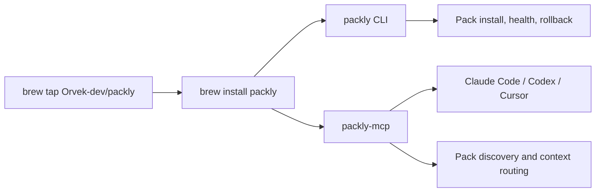

<p align="center">
  
</p>

<p align="center">
  <a href="https://github.com/Orvek-dev/packly-developer-preview/releases/tag/v0.59.1"></a>
  
  
  
  
</p>

# Homebrew Tap for Packly

Official Homebrew tap for the Packly Developer Preview.

Packly installs a local CLI and stdio MCP server for Claude Code, Codex, and Cursor. It helps agents find and read the right Pack context without turning every workspace into a giant `CLAUDE.md` or `AGENTS.md`.

## Install

```sh
brew tap Orvek-dev/packly
brew install packly
```

Or install directly:

```sh
brew install Orvek-dev/packly/packly
```

## At A Glance

| Surface | What this tap gives you |
| --- | --- |
| `packly` | Local CLI for Pack install/update, readiness checks, snapshots, and rollback. |
| `packly-mcp` | Local stdio MCP server launched by Claude Code, Codex, or Cursor. |
| Version | Current Developer Preview release: `v0.59.1`. |
| Platforms | macOS Apple Silicon and Linux x64 through Homebrew. |
| Windows | Use the release zip from the Developer Preview repository. |

## Install Flow



## Verify

```sh
packly --version
packly mcp status --mcp-bin packly-mcp
packly mcp readiness --no-workspace --mcp-bin packly-mcp
```

## Connect MCP

Generate client setup snippets:

```sh
packly mcp config --client all --mcp-bin packly-mcp
```

Packly MCP runs locally over stdin/stdout. It is not a hosted service.

## Upgrade

```sh
brew update
brew upgrade packly
```

## Uninstall

```sh
brew uninstall packly
brew untap Orvek-dev/packly
```

## More

| Link | Purpose |
| --- | --- |
| [Website](https://usepackly.com) | Product overview and install path. |
| [Developer Preview](https://github.com/Orvek-dev/packly-developer-preview) | Public distribution, docs, sample Packs, feedback, and releases. |
| [Releases](https://github.com/Orvek-dev/packly-developer-preview/releases) | Versioned Packly CLI/MCP artifacts. |
| [Security Policy](SECURITY.md) | Vulnerability reporting guidance. |
